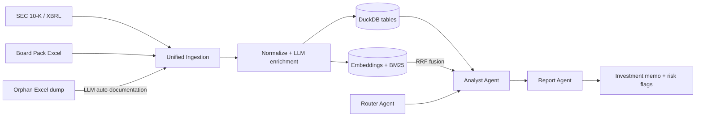
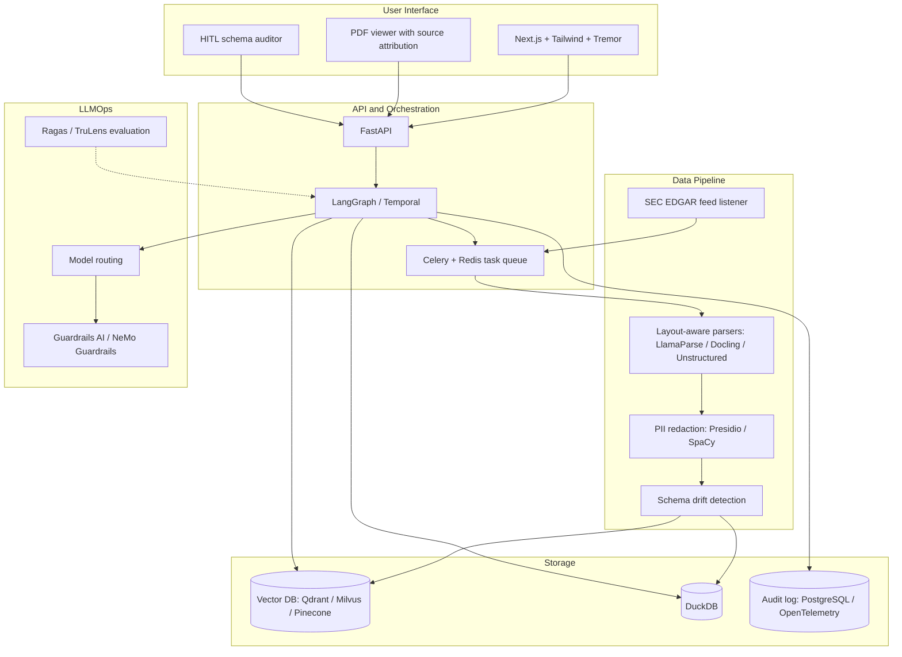
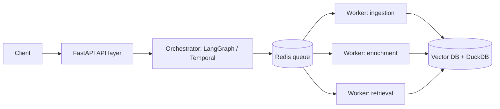
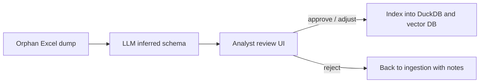
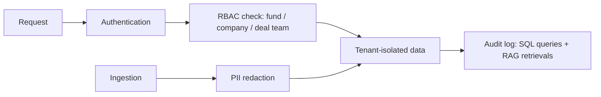
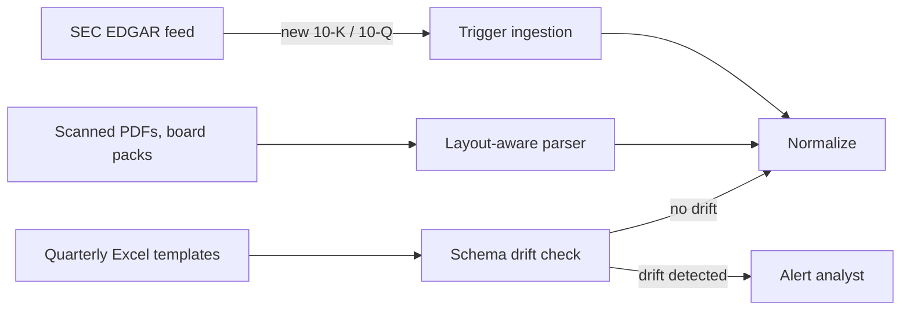
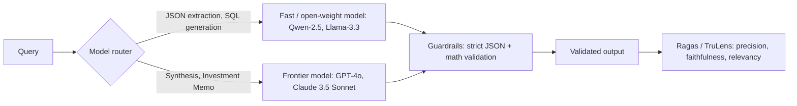

# Private Markets Document Multi-Agents

A Jupyter notebook that builds a **hybrid RAG + multi-agent pipeline** for private-markets (Private Equity / Venture Capital) financial documents. It ingests SEC filings, board packs and undocumented Excel dumps, and produces an investment-committee memo with risk flags.

> Everything lives in [testing_sistem_market.ipynb](testing_sistem_market.ipynb). Each step has a markdown cell explaining the logic and the underlying math.

## Why this project

Financial documents arrive in very different shapes: structured XBRL from the SEC, Excel board packs from portfolio companies, and header-less raw dumps sent by email. This project normalizes them into one format and answers questions with two complementary mechanisms:

- **Exact numbers** come from SQL (DuckDB), so the LLM never has to recall figures.
- **Context and interpretation** come from hybrid search (vector embeddings + BM25), fused with Reciprocal Rank Fusion (RRF).

## Pipeline



| Phase | What it does | Key output |
|---|---|---|
| 1. Ingestion | Loads public (SEC), private (board pack) and orphan (no headers) tables | Standard document dictionaries |
| 2. Processing | Cleans data, validates with Pydantic, enriches with an LLM narrative | `RAGReadyChunkSchema` objects |
| 3. Retrieval | DuckDB for SQL, dense vectors and BM25 combined with RRF | `UnifiedHybridRetriever` |
| 4. Agents | Router, Analyst and Report agents orchestrated with LangGraph | Executive memo + risk flags |

## Key concepts

- **Orphan table auto-documentation:** an LLM reconstructs title, headers, currency and period for tables without metadata, and flags them with `is_inferred_schema` and `inference_confidence` for auditability.
- **Three views per chunk:** `vectorContent` (embedded), `rawContent` (exact Markdown table) and `structuredTable` (canonical JSON for SQL).
- **Cosine similarity:** $\text{sim}(\mathbf{q}, \mathbf{d}) = \hat{\mathbf{q}} \cdot \hat{\mathbf{d}}$ on L2-normalized embeddings.
- **BM25:** keyword ranking with term-frequency saturation and length normalization.
- **RRF:** $\text{RRF}(d) = \sum_r \frac{1}{k + \text{rank}_r(d)}$ with $k = 60$.
- **Financial metrics covered:** gross/EBITDA margin, YoY/QoQ growth, NRR, LTV/CAC, CAC payback, Burn Multiple, Rule of 40.

## Data source: the SEC

Public-company data comes from the **U.S. Securities and Exchange Commission (SEC)**: https://www.sec.gov/

The SEC is the U.S. federal agency that regulates securities markets and protects investors. Listed companies must file periodic reports with it, for example the annual report (**10-K**). These filings are published for free through **EDGAR** (Electronic Data Gathering, Analysis, and Retrieval) and include financial statements in structured **XBRL** format, which this project reads with the `edgartools` library.

Private-company data (board pack and orphan dump) is **synthetic** and generated by the notebook; it does not come from the SEC or any real company.

## Requirements

- Python 3.10+
- An OpenAI API key
- An identity (name + email) for SEC EDGAR requests
- Internet access (SEC EDGAR and OpenAI)

Main libraries: `edgartools`, `pandas`, `openpyxl`, `pydantic`, `openai`, `tabulate`, `python-dotenv`, `duckdb`, `rank-bm25`, `numpy`, `langgraph`. The notebook installs them in its own `pip install` cells.

## Setup

1. Clone the repository:
   ```bash
   git clone https://github.com/arianspacesistem/private_markets_math_boy
   cd private_markets_math_boy
   ```
2. Create your environment file:
   ```bash
   cp .env.example .env
   ```
3. Edit `.env` with your real values:

   | Variable | Description |
   |---|---|
   | `SEC_IDENTITY_NAME` | Your name (required by the SEC User-Agent policy) |
   | `SEC_IDENTITY_EMAIL` | Your email (same reason) |
   | `OPENAI_API_KEY` | OpenAI API key |

4. Open `testing_sistem_market.ipynb` in VS Code or Jupyter and run the cells in order.

`.env` is listed in `.gitignore`; never commit real secrets.

## Project structure

```
.
├── testing_sistem_market.ipynb   # Full pipeline (ingestion -> agents)
├── .env.example                  # Environment variable template
├── .env                          # Your local secrets (git-ignored)
├── .gitignore
├── LICENSE
└── data/                         # Generated Excel samples (git-ignored)
```

## Usage example

The last cell runs the full pipeline for a company whose data came from an orphan Excel file:

```python
run_pipeline(
    "Analyze the operating efficiency, ARR, Burn Multiple and SaaS metrics "
    "of Apex Analytics (Portfolio Co #7) and produce a risk report."
)
```

The Router picks the company and intent, the Analyst combines SQL and hybrid-search evidence, and the Report Agent prints the memo with risk flags.

## Known limitations

- The test data is **synthetic** (mock board pack and orphan dump); only AAPL and MSFT come from real SEC data.
- `ChunkMetadataSchema` does not define `is_inferred_schema`, so the audit warning in the Report Agent does not trigger yet.
- The Router falls back to `PORTFOLIO_CO_04` when the company is unclear, which can hide routing errors.
- DuckDB table names are built from internal metadata; validate them before accepting user-supplied names (SQL injection risk).
- LLM-inferred schemas are probabilistic; route low-confidence results to human review.

## Production Roadmap & Next Steps

While the current Python prototype demonstrates a complete end-to-end multi-agent system with high mathematical precision, scaling this solution for an enterprise-grade private equity or venture capital environment requires addressing several production challenges.

Below is the technical roadmap for production hardening.



Summary of the target improvements by area:

| Area | Prototype today | Production target |
|---|---|---|
| Architecture | Single notebook | FastAPI + orchestrator + workers |
| Vector store | In-memory / hosted | Qdrant / Milvus / Pinecone, multi-tenant |
| Interface | Notebook output | Next.js dashboard with source viewer |
| Security | Local `.env` | RBAC, PII redaction, audit logging |
| Parsing | Excel and XBRL | Layout-aware OCR for PDFs and charts |
| Evaluation | Manual inspection | Continuous Ragas / TruLens benchmarks |

---

### 1. Architecture & Infrastructure Scalability



* **Microservices Decoupling:** Migrate from a monolithic notebook environment to modular microservices using **FastAPI** (API Layer), **LangGraph / Temporal** (Orchestrator), and dedicated worker nodes.
* **Distributed Task Queue:** Implement **Celery + Redis** (or Temporal.io) to handle asynchronous, heavy batch ingestion of SEC filings and multi-tab portfolio Excel sheets without blocking API threads.
* **Enterprise Vector Database:** Transition from in-memory/hosted stores to a managed vector database (**Qdrant / Milvus / Pinecone**) supporting multi-tenant collection isolation and metadata filtering at scale.

---

### 2. User Interface & Interactive Human-in-the-Loop (HITL)



* **Full-Stack Web Application:** Build a production frontend using **Next.js (React) + Tailwind CSS + Tremor** for real-time financial dashboards and streaming agent outputs.
* **Source Attribution & PDF Viewer:** Integrate an interactive document viewer with **bounding-box highlighting**, linking generated memo text directly to the exact page, table, or cell in the original source file.
* **Human-in-the-Loop Schema Auditor:** Provide an interactive verification UI where financial analysts can review, approve, or adjust LLM-inferred table schemas (e.g., orphan Excel dumps) before indexing them into DuckDB.

---

### 3. Security, Compliance & Multi-Tenancy



* **Multi-Tenant Data Isolation:** Enforce strict logical and physical data boundaries between different funds, portfolio companies, and deal teams using Role-Based Access Control (**RBAC**).
* **Data Masking & PII Redaction:** Integrate pre-ingestion anonymization pipelines (**Microsoft Presidio / SpaCy**) to redact sensitive individual compensation figures, founder details, or non-public personal information.
* **Audit Logging & Compliance:** Implement comprehensive event logging (PostgreSQL / OpenTelemetry) tracking every SQL query executed by DuckDB and every RAG retrieval for SOC-2 compliance.

---

### 4. Data Pipeline & Pre-RAG Conditioning Enhancements



* **Advanced Multimodal OCR / Parsing:** Incorporate specialized layout-aware parsers (**LlamaParse / Docling / Unstructured**) to handle complex multi-column board packs, scanned PDFs, and embedded chart images.
* **Real-time SEC EDGAR Webhooks:** Set up real-time event listeners using SEC EDGAR feeds to automatically trigger ingestion pipelines whenever target public companies release new 10-K or 10-Q filings.
* **Schema Drift Detection:** Add automated alerts when portfolio companies alter their quarterly Excel report templates, flagging structural changes before running automated SQL extractions.

---

### 5. LLMOps, Evaluation & Cost Optimization



* **RAG Evaluation Suite (Ragas / TruLens):** Establish continuous CI/CD evaluation benchmarking **Context Precision**, **Faithfulness**, and **Answer Relevancy** across financial queries.
* **Model Routing & Cost Efficiency:** Implement dynamic model routing (using fast/open-weight models like **Qwen-2.5** or **Llama-3.3** for structured JSON extraction and SQL generation, reserving **GPT-4o / Claude 3.5 Sonnet** for synthesis and Investment Memos).
* **Deterministic Guardrails:** Implement **Guardrails AI / NeMo Guardrails** to guarantee 100% strict JSON output adherence and enforce hard mathematical validation rules prior to report generation.

---

## License

See [LICENSE](LICENSE).
